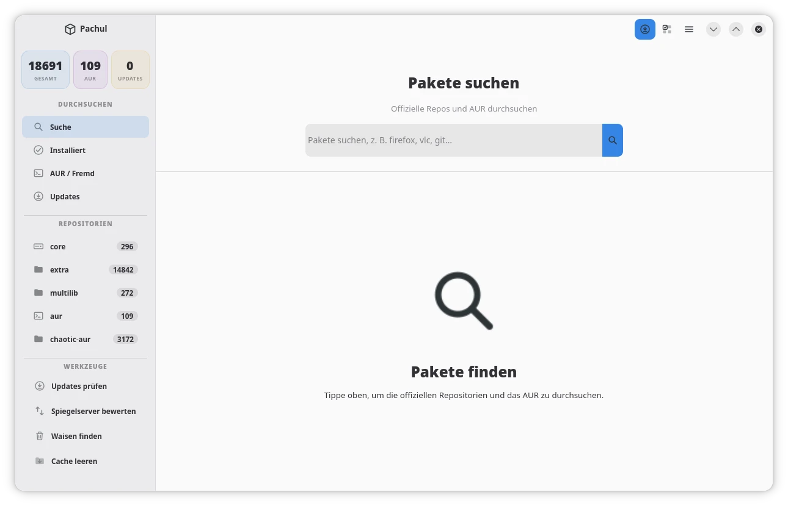

<div align="center">



# Pachul

**A modern, graphical package manager for Arch Linux and Manjaro**
**Ein moderner, grafischer Paketmanager für Arch Linux und Manjaro**

[](https://www.gnu.org/licenses/old-licenses/gpl-2.0)
[](https://archlinux.org)
[](https://aur.archlinux.org)
[](https://gtk.org)
[](https://www.python.org)
[](#-language--sprache)

**[English](#-english)** · **[Deutsch](#-deutsch)**

</div>

---

<a id="-english"></a>
# 🇬🇧 English

## Table of Contents

- [Overview](#overview)
- [What's New](#whats-new)
- [Screenshots](#screenshots)
- [Features](#features)
- [Installation](#installation)
- [Usage](#usage)
- [Background Update Notifications](#background-update-notifications)
- [Language](#language)
- [Project Structure](#project-structure)
- [Troubleshooting](#troubleshooting)
- [Contributing](#contributing)
- [License](#license)

---

## Overview

Pachul is a clean, fast GTK4 / libadwaita frontend for `pacman` and the AUR. It lets you search, install, update and manage packages without touching the terminal — while still giving you full, transparent control: every privileged action runs through a visible terminal panel, so you always see exactly what command is being executed.

Pachul follows the GNOME Human Interface Guidelines and adapts automatically to your system's light or dark style.

**Repository:** [github.com/wergosam/Pachul](https://github.com/wergosam/Pachul)

---

## What's New

Recent improvements to the terminal/privileged-action panel:

- **Password field auto-focus** — the sudo password field is now focused automatically as soon as the terminal dialog opens, so you can start typing immediately without clicking into it first.
- **Automatic stale-lock recovery** — if pacman reports a locked database (`db.lck`), Pachul detects this and offers a one-click **"Remove Lock & Retry"** fix. It first checks (via `fuser`) whether anything is *actually* still holding the lock, so it never removes it out from under a genuinely running operation.
- **Cleaner terminal output** — newer escape sequences some systems emit around `sudo` (systemd/pam_systemd session markers) are now filtered out instead of appearing as raw, unreadable text in the output panel.

See [Troubleshooting](#troubleshooting) below if you keep seeing database-lock errors — it's usually caused by another package-management daemon (PackageKit, Manjaro's `pamac-daemon`) running alongside Pachul.

---

## Screenshots

<table>
<tr>
<td align="center">
<br/>
<sub><b>Package Search</b> — Browse official repos and AUR with live package counts</sub>
</td>
<td align="center">
<br/>
<sub><b>Tools Menu</b> — Sync databases, rate mirrors, manage config files and more</sub>
</td>
</tr>
</table>

---

## Features

### Package management
- **Search** official repositories and the AUR simultaneously, with live result counts
- **Browse** packages by repository: `core`, `extra`, `multilib`, `aur`, `chaotic-aur`
- **Installed packages** — view, filter and manage everything on your system
- **AUR / Foreign** packages tracked separately, with source clearly badged
- **Update manager** — see all available updates at a glance and upgrade in one click, or one at a time
- **Downgrade** — reinstall an older cached version straight from `/var/cache/pacman/pkg`
- **Detail panel** — description, dependencies, size, install reason, build/install dates, and full `pacman -Qi` raw output for every package

### Tools
- Sync Databases (`F5`)
- Check for Updates (`Strg+U` / `Ctrl+U`)
- **Rate Mirrors** — geo-aware ranking via `rate-mirrors`, with sort order, HTTPS-only filter, automatic backup and configurable mirror count
- Find Orphans — bulk-remove packages that are no longer required by anything
- Clean Cache
- Manage Repositories — inspect enabled repos and edit `pacman.conf` directly
- View / Merge Config Files (`.pacnew` / `.pacsave`) with a side-by-side diff view
- Package History
- System Info — OS, kernel, hardware, package counts and cache size at a glance
- Export / Import Package Lists — great for reproducing a setup on a new machine
- View PKGBUILD (AUR) before installing
- Hold / Unhold Selected Packages (via `IgnorePkg`)
- Mark Selected as Explicit or as Dependency
- Arch Linux news check before system upgrades, so you never miss a manual-intervention notice

### Quality of life
- **Background update checks** — an optional `systemd --user` timer checks for updates and sends a desktop notification even while Pachul is closed
- **Multi-language interface** — English, German, French and Italian, switchable in Preferences
- **Keyboard shortcuts** for all common actions
- Light and dark theme support, following your system style automatically
- Confirmation dialogs before destructive actions (configurable)

---

## Installation

### From the AUR

```bash
yay -S pachul
```

### Manual (from source)

```bash
git clone https://github.com/wergosam/Pachul.git
cd Pachul
python app.py
```

**Dependencies:**

| Package | Purpose |
|---------|---------|
| `python` ≥ 3.10 | Runtime |
| `python-gobject` | GTK4 / Adwaita Python bindings |
| `gtk4` | GUI toolkit |
| `libadwaita` | GNOME-style widgets and theming |
| `pacman` | Package backend |
| `yay`, `paru` or `pikaur` | AUR support (optional, auto-detected) |
| `rate-mirrors` | Mirror ranking (optional) |
| `systemd` | Background update-check timer (optional) |

---

## Usage

| Action | Shortcut |
|--------|----------|
| Focus Search | `Strg+F` / `Ctrl+F` |
| Sync Databases | `F5` |
| Refresh List | `Strg+R` / `Ctrl+R` |
| Check for Updates | `Strg+U` / `Ctrl+U` |
| Preferences | `Strg+,` / `Ctrl+,` |
| Keyboard Shortcuts | `Strg+?` / `Ctrl+?` |
| Quit | `Strg+Q` / `Ctrl+Q` |

---

## Background Update Notifications

Enable **Run background update checks** in Preferences to install a `systemd --user` timer (`pachul-update-check`). It runs headlessly on a schedule (no GTK dependency in this code path) and sends a desktop notification via `notify-send` when updates are available — even if Pachul itself isn't running.

The check interval — **hourly**, **every 6 hours**, or **daily** — is configurable in Preferences alongside the toggle.

---

## Language

Pachul currently ships with **English, German, French and Italian** translations, covering the entire interface: menus, dialogs, toasts, and terminal-panel messages.

Change the interface language under **Preferences → Language**. The choice is saved immediately; the change takes full effect after restarting Pachul.

---

## Project Structure

```
pachul/
├── app.py          # Adw.Application entry point, GActions & accelerators
├── window.py       # Main window: sidebar, list view, detail panel, search page
├── dialogs.py      # Secondary dialogs (repos, mirrors, orphans, history,
│                    #   downgrade, PKGBUILD, pacdiff, preferences, shortcuts, news)
├── models.py       # GObject package model, virtualized ListView, sidebar rows
├── backend.py      # pacman / AUR integration, settings, systemd timer helpers
├── notifier.py     # Headless entry point for the systemd background timer
├── styles.py       # Application-wide CSS
├── i18n.py         # Dictionary-based translations (EN / DE / FR / IT)
├── screenshots/    # README assets
└── requirements.txt
```

---

## Troubleshooting

- **No AUR results / AUR actions fail** — install `yay`, `paru`, or `pikaur`, or set the helper explicitly in Preferences → AUR Helper.
- **Background notifications never appear** — check the timer is enabled in Preferences, and that `notify-send` (usually part of `libnotify`) is installed.
- **Mirror rating tool missing** — install `rate-mirrors` from the AUR; Pachul offers a one-click install button when it's absent.
- **Language doesn't fully change** — some UI elements are only re-translated after a full restart of Pachul; this is expected.
- **"Failed to lock database" / `db.lck` errors, especially right after every single operation** — usually caused by another package-management daemon running alongside Pachul and briefly re-locking the same database (commonly PackageKit, or on Manjaro, `pamac-daemon` together with its tray icon). Pachul offers an automatic **Remove Lock & Retry** fix for one-off cases, but if it keeps recurring, disable the conflicting service for good, e.g.:
  ```bash
  sudo systemctl mask pamac-daemon
  ```
  and disable its tray-icon autostart if you use Pachul as your primary package manager. To confirm what's actually holding the lock at the moment it happens, run `sudo fuser -v /var/lib/pacman/db.lck`.

Found a bug that isn't covered here? Please [open an issue](https://github.com/wergosam/Pachul/issues).

---

## Contributing

Pull requests are welcome. For major changes, please [open an issue](https://github.com/wergosam/Pachul/issues) first to discuss what you'd like to change.

1. Fork the repository
2. Create your feature branch: `git checkout -b feature/my-feature`
3. Commit your changes: `git commit -m 'Add my feature'`
4. Push to the branch: `git push origin feature/my-feature`
5. Open a Pull Request

New UI strings should be added to all four language tables in `i18n.py` (`STRINGS_DE`, `STRINGS_FR`, `STRINGS_IT`) to keep translations complete.

---

## License

This project is licensed under the **GNU General Public License v2.0** — see the [LICENSE](https://github.com/wergosam/Pachul/blob/main/LICENSE) file for details.

---

<div align="center">

[⬆ Back to top](#pachul)

</div>

<br>

---

<a id="-deutsch"></a>
# 🇩🇪 Deutsch

## Inhaltsverzeichnis

- [Übersicht](#übersicht)
- [Neuigkeiten](#neuigkeiten)
- [Screenshots](#screenshots-1)
- [Funktionen](#funktionen)
- [Installation](#installation-1)
- [Verwendung](#verwendung)
- [Hintergrund-Update-Benachrichtigungen](#hintergrund-update-benachrichtigungen)
- [Sprache](#sprache)
- [Projektstruktur](#projektstruktur)
- [Fehlerbehebung](#fehlerbehebung)
- [Mitwirken](#mitwirken)
- [Lizenz](#lizenz-1)

---

## Übersicht

Pachul ist ein schlankes, schnelles GTK4- / libadwaita-Frontend für `pacman` und das AUR. Es ermöglicht das Suchen, Installieren, Aktualisieren und Verwalten von Paketen, ohne das Terminal anzufassen — und behält dabei volle, transparente Kontrolle: Jede privilegierte Aktion läuft über ein sichtbares Terminal-Panel, sodass du immer genau siehst, welcher Befehl ausgeführt wird.

Pachul folgt den GNOME-Gestaltungsrichtlinien (HIG) und passt sich automatisch an den hellen oder dunklen Stil deines Systems an.

**Repository:** [github.com/wergosam/Pachul](https://github.com/wergosam/Pachul)

---

## Neuigkeiten

Aktuelle Verbesserungen am Terminal-/Privilegien-Panel:

- **Automatischer Fokus auf das Passwortfeld** — das Sudo-Passwortfeld wird jetzt automatisch fokussiert, sobald sich der Terminal-Dialog öffnet, sodass du sofort tippen kannst, ohne vorher hineinzuklicken.
- **Automatische Behebung veralteter Sperren** — meldet Pacman eine gesperrte Datenbank (`db.lck`), erkennt Pachul das und bietet einen Ein-Klick-Fix **„Sperre entfernen & erneut versuchen"** an. Vorher wird per `fuser` geprüft, ob überhaupt noch etwas die Sperre wirklich hält, damit sie nie unter einem tatsächlich laufenden Vorgang entfernt wird.
- **Saubere Terminal-Ausgabe** — neuere Escape-Sequenzen, die manche Systeme rund um `sudo` ausgeben (systemd-/pam_systemd-Sitzungsmarkierungen), werden jetzt herausgefiltert, statt als roher, unlesbarer Text im Ausgabebereich zu erscheinen.

Siehe [Fehlerbehebung](#fehlerbehebung) weiter unten, falls weiterhin Datenbank-Sperre-Fehler auftreten — meist verursacht durch einen weiteren, parallel laufenden Paketverwaltungs-Dienst (PackageKit, Manjaros `pamac-daemon`).

---

## Screenshots

<table>
<tr>
<td align="center">
<br/>
<sub><b>Paketsuche</b> — Offizielle Repos und AUR durchsuchen, mit Live-Paketzahlen</sub>
</td>
<td align="center">
<br/>
<sub><b>Werkzeuge-Menü</b> — Datenbanken synchronisieren, Spiegelserver bewerten, Konfigurationsdateien verwalten und mehr</sub>
</td>
</tr>
</table>

---

## Funktionen

### Paketverwaltung
- **Suche** gleichzeitig in offiziellen Repositorien und im AUR, mit Live-Trefferzahl
- **Durchsuchen** nach Repository: `core`, `extra`, `multilib`, `aur`, `chaotic-aur`
- **Installierte Pakete** — alles auf deinem System ansehen, filtern und verwalten
- **AUR / Fremde** Pakete werden separat erfasst, mit klar erkennbarer Herkunfts-Badge
- **Update-Verwaltung** — alle verfügbaren Updates auf einen Blick, mit einem Klick alle oder einzeln aktualisieren
- **Downgrade** — eine ältere zwischengespeicherte Version direkt aus `/var/cache/pacman/pkg` neu installieren
- **Detailansicht** — Beschreibung, Abhängigkeiten, Größe, Installationsgrund, Build-/Installationsdatum sowie die vollständige `pacman -Qi`-Rohausgabe zu jedem Paket

### Werkzeuge
- Datenbanken synchronisieren (`F5`)
- Auf Updates prüfen (`Strg+U`)
- **Spiegelserver bewerten** — standortbasiertes Ranking über `rate-mirrors`, mit Sortieroptionen, Nur-HTTPS-Filter, automatischer Sicherung und einstellbarer Anzahl der Spiegelserver
- Waisen finden — nicht mehr benötigte Pakete gesammelt entfernen
- Cache leeren
- Repositorien verwalten — aktivierte Repos einsehen und `pacman.conf` direkt bearbeiten
- Konfigurationsdateien anzeigen/zusammenführen (`.pacnew` / `.pacsave`) mit Diff-Ansicht nebeneinander
- Paketverlauf
- Systeminformationen — Betriebssystem, Kernel, Hardware, Paketanzahl und Cache-Größe auf einen Blick
- Paketlisten exportieren/importieren — praktisch, um ein Setup auf einem neuen Rechner zu reproduzieren
- PKGBUILD (AUR) vor der Installation ansehen
- Ausgewählte Pakete sperren/entsperren (über `IgnorePkg`)
- Auswahl als explizit oder als Abhängigkeit markieren
- Arch-Linux-News-Prüfung vor Systemaktualisierungen, damit manuelle Eingriffe nie übersehen werden

### Komfortfunktionen
- **Hintergrund-Update-Prüfung** — ein optionaler `systemd --user`-Timer prüft auf Updates und sendet eine Desktop-Benachrichtigung, auch wenn Pachul geschlossen ist
- **Mehrsprachige Oberfläche** — Englisch, Deutsch, Französisch und Italienisch, umschaltbar in den Einstellungen
- **Tastenkombinationen** für alle gängigen Aktionen
- Unterstützung für helles und dunkles Design, folgt automatisch dem Systemstil
- Bestätigungsdialoge vor destruktiven Aktionen (einstellbar)

---

## Installation

### Aus dem AUR

```bash
yay -S pachul
```

### Manuell (aus dem Quellcode)

```bash
git clone https://github.com/wergosam/Pachul.git
cd Pachul
python app.py
```

**Abhängigkeiten:**

| Paket | Zweck |
|---------|---------|
| `python` ≥ 3.10 | Laufzeitumgebung |
| `python-gobject` | GTK4-/Adwaita-Python-Bindings |
| `gtk4` | GUI-Toolkit |
| `libadwaita` | GNOME-typische Widgets und Theming |
| `pacman` | Paket-Backend |
| `yay`, `paru` oder `pikaur` | AUR-Unterstützung (optional, automatisch erkannt) |
| `rate-mirrors` | Spiegelserver-Bewertung (optional) |
| `systemd` | Timer für Hintergrund-Update-Prüfung (optional) |

---

## Verwendung

| Aktion | Tastenkombination |
|--------|----------|
| Suche fokussieren | `Strg+F` |
| Datenbanken synchronisieren | `F5` |
| Liste aktualisieren | `Strg+R` |
| Auf Updates prüfen | `Strg+U` |
| Einstellungen | `Strg+,` |
| Tastenkombinationen | `Strg+?` |
| Beenden | `Strg+Q` |

---

## Hintergrund-Update-Benachrichtigungen

Aktiviere **Update-Prüfungen im Hintergrund ausführen** in den Einstellungen, um einen `systemd --user`-Timer (`pachul-update-check`) einzurichten. Dieser läuft nach Zeitplan headless (in diesem Codepfad ohne GTK-Abhängigkeit) und sendet über `notify-send` eine Desktop-Benachrichtigung, sobald Updates verfügbar sind — auch wenn Pachul selbst nicht läuft.

Das Prüfintervall — **stündlich**, **alle 6 Stunden** oder **täglich** — lässt sich zusammen mit dem Schalter in den Einstellungen konfigurieren.

---

## Sprache

Pachul wird aktuell mit Übersetzungen in **Englisch, Deutsch, Französisch und Italienisch** ausgeliefert und deckt die gesamte Oberfläche ab: Menüs, Dialoge, Toasts und Terminal-Panel-Meldungen.

Die Sprache lässt sich unter **Einstellungen → Sprache** ändern. Die Auswahl wird sofort gespeichert; die Änderung wirkt sich vollständig nach einem Neustart von Pachul aus.

---

## Projektstruktur

```
pachul/
├── app.py          # Adw.Application-Einstiegspunkt, GActions & Tastenkürzel
├── window.py       # Hauptfenster: Seitenleiste, Listenansicht, Detailansicht, Suchseite
├── dialogs.py      # Alle weiteren Dialoge (Repos, Spiegelserver, Waisen, Verlauf,
│                    #   Downgrade, PKGBUILD, Pacdiff, Einstellungen, Kurzbefehle, News)
├── models.py       # GObject-Paketmodell, virtualisierte ListView, Seitenleisten-Zeilen
├── backend.py      # pacman-/AUR-Integration, Einstellungen, systemd-Timer-Hilfsfunktionen
├── notifier.py     # Headless-Einstiegspunkt für den systemd-Hintergrund-Timer
├── styles.py       # Anwendungsweites CSS
├── i18n.py         # Wörterbuch-basierte Übersetzungen (EN / DE / FR / IT)
├── screenshots/    # README-Grafiken
└── requirements.txt
```

---

## Fehlerbehebung

- **Keine AUR-Ergebnisse / AUR-Aktionen schlagen fehl** — installiere `yay`, `paru` oder `pikaur`, oder lege den Helfer explizit unter Einstellungen → AUR-Helfer fest.
- **Hintergrund-Benachrichtigungen erscheinen nie** — prüfe, ob der Timer in den Einstellungen aktiviert ist und ob `notify-send` (üblicherweise Teil von `libnotify`) installiert ist.
- **Werkzeug zur Spiegelserver-Bewertung fehlt** — installiere `rate-mirrors` aus dem AUR; Pachul bietet dafür einen Ein-Klick-Installationsbutton an, falls es fehlt.
- **Sprache wechselt nicht vollständig** — manche UI-Elemente werden erst nach einem vollständigen Neustart von Pachul neu übersetzt; das ist beabsichtigt.
- **„Datenbank kann nicht gesperrt werden" / `db.lck`-Fehler, besonders nach jedem einzelnen Vorgang** — meist verursacht durch einen weiteren, parallel laufenden Paketverwaltungs-Dienst, der dieselbe Datenbank kurz danach erneut sperrt (häufig PackageKit, oder unter Manjaro `pamac-daemon` zusammen mit dessen Tray-Icon). Pachul bietet für Einzelfälle einen automatischen Fix **„Sperre entfernen & erneut versuchen"** an — tritt es aber wiederholt auf, den störenden Dienst dauerhaft deaktivieren, z. B.:
  ```bash
  sudo systemctl mask pamac-daemon
  ```
  und dessen Tray-Icon-Autostart deaktivieren, falls du Pachul als deinen Haupt-Paketmanager nutzt. Um herauszufinden, was die Sperre im konkreten Moment tatsächlich hält, hilft `sudo fuser -v /var/lib/pacman/db.lck`.

Einen Fehler gefunden, der hier nicht behandelt wird? Bitte [ein Issue eröffnen](https://github.com/wergosam/Pachul/issues).

---

## Mitwirken

Pull Requests sind willkommen. Bei größeren Änderungen bitte zuerst [ein Issue eröffnen](https://github.com/wergosam/Pachul/issues), um das gewünschte Vorhaben zu besprechen.

1. Repository forken
2. Feature-Branch erstellen: `git checkout -b feature/my-feature`
3. Änderungen committen: `git commit -m 'Add my feature'`
4. Branch pushen: `git push origin feature/my-feature`
5. Pull Request eröffnen

Neue UI-Texte sollten in allen vier Sprachtabellen in `i18n.py` (`STRINGS_DE`, `STRINGS_FR`, `STRINGS_IT`) ergänzt werden, damit die Übersetzungen vollständig bleiben.

---

## Lizenz

Dieses Projekt steht unter der **GNU General Public License v2.0** — siehe die [LICENSE](https://github.com/wergosam/Pachul/blob/main/LICENSE)-Datei für Details.

---

<div align="center">

[⬆ Nach oben](#pachul)

</div>

<br>

---

<div align="center">
Made for the Arch Linux community 🐧 · Gemacht für die Arch-Linux-Community 🐧
</div>
